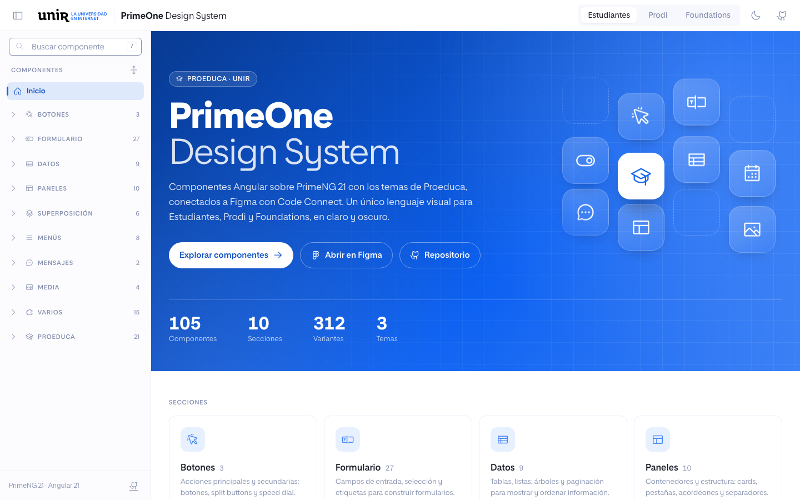
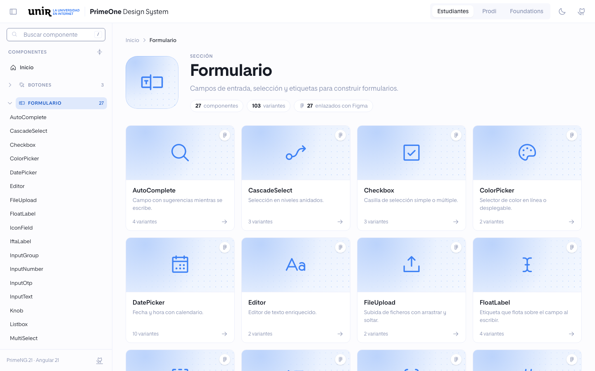
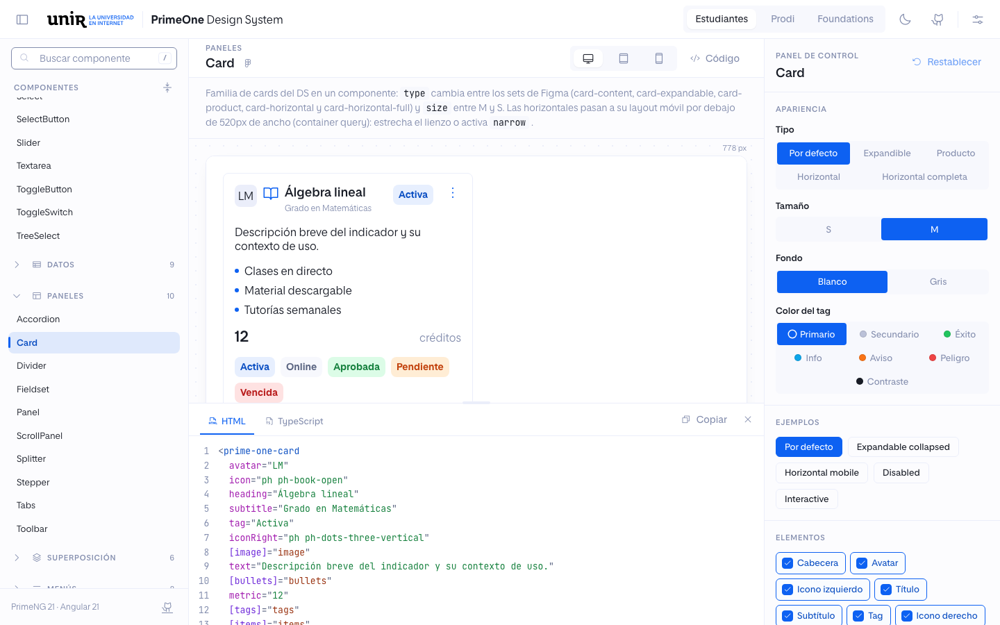
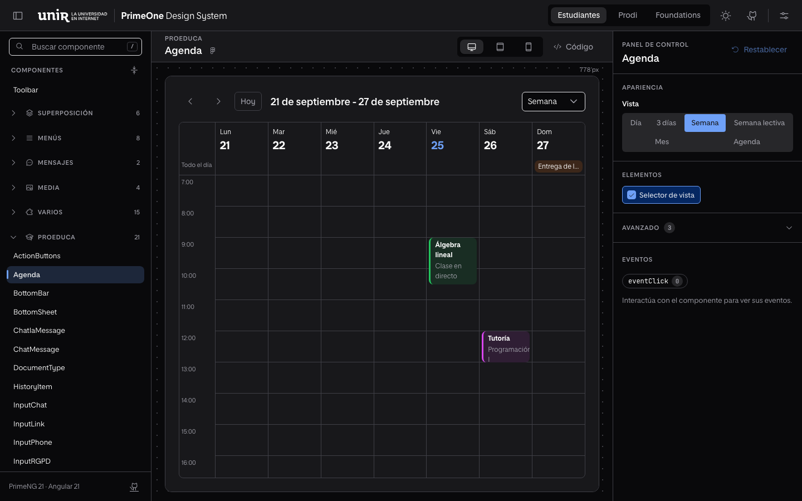

# PrimeOne DS

Librería Angular del design system PrimeOne: componentes PrimeNG 21 (licencia MIT) con los presets del DS y componentes propios de Proeduca (`prime-one-*`), conectados a Figma con Code Connect.

## Capturas

Explorador del DS (`npm run explorer`).



| Sección | Componente |
| --- | --- |
|  |  |



## Requisitos

- Node.js `^20.19.0`, `^22.12.0` o `>=24` (requisito de Angular 21)
- `npm install`

## Comandos

| Comando | Qué hace |
| --- | --- |
| `npm run build` | Compila la librería en `dist/prime-one-ds` (ng-packagr) |
| `npm run storybook` | Navegable de componentes en `http://localhost:6006` |
| `npm run build-storybook` | Genera el navegable estático en `storybook-static/` |
| `npm run explorer` | Explorador del DS (catálogo, componente en vivo y panel de control) en `http://localhost:4300` |
| `npm run build-explorer` | Genera el explorador estático en `dist/explorer/browser` |
| `npm run figma:parse` | Valida las plantillas de Code Connect sin publicar |
| `npm run figma:publish` | Publica Code Connect en Figma (requiere token) |

## Uso

```ts
import { providePrimeNG } from 'primeng/config';
import { PrimeOneEstudiantes } from 'prime-one-ds';

providePrimeNG({ theme: { preset: PrimeOneEstudiantes, options: { darkModeSelector: '.po-dark' } } });
```

Presets disponibles: `PrimeOneEstudiantes`, `PrimeOneProdi`, `PrimeOneFoundations`. El modo oscuro se activa con la clase `po-dark` en `<html>`. Los iconos son de Phosphor (`@phosphor-icons/web`): los componentes usan los pesos regular, bold y fill, así que la app debe cargar `src/regular/style.css`, `src/bold/style.css` y `src/fill/style.css`.

La tipografía es Proeduca Sans (`src/fonts/`, pesos 200 a 800 con cursivas). El explorador y Storybook la cargan desde `src/fonts/proeduca-sans.css`; una app que use el DS debe incluir ese CSS en sus `styles`.

`p-editor` no se reexporta desde `prime-one-ds`: PrimeNG carga `quill` bajo demanda y quien lo use debe instalarlo (`npm install quill`).

## Storybook

Cada componente tiene una story con controles generados desde su API real (inputs de PrimeNG 21 y de los componentes `prime-one-*`). La barra superior permite cambiar de tema (Estudiantes, Prodi, Foundations) y de modo (claro u oscuro). Los eventos aparecen en el panel Actions.

## Explorador

App Angular propia (`explorer/`) para enseñar el DS: navbar con tema (Estudiantes, Prodi, Foundations) y modo claro u oscuro, catálogo a la izquierda, el componente real en el centro y el panel de control a la derecha (las dos columnas laterales se pliegan). Cada componente muestra sus variantes, todas sus propiedades, el registro de eventos y el código listo para copiar (HTML y TypeScript) con los valores actuales.

- Arranca en una home (hero con las cifras del DS y las secciones del catálogo). Cada sección tiene una vista general con una ficha visual por componente (`?s=Form`); el componente se abre con `?c=<id>`. Atrás y adelante del navegador funcionan entre páginas. Iconos y resúmenes de las fichas en `explorer/src/app/catalog-meta.ts`.
- El componente se renderiza en un iframe con el ancho del dispositivo elegido (escritorio, tablet o móvil), así que sus media queries responden como en un dispositivo real.
- La propia app es responsive: por debajo de 1024px el catálogo y el panel de control pasan a paneles que se abren desde el navbar.
- El dispositivo sigue a la ventana: por debajo de 1024px la vista pasa a tablet y por debajo de 768px a móvil, con el tema en un desplegable. Se puede cambiar a mano hasta el siguiente salto de ancho.
- El panel de código tiene cuatro pestañas: HTML, TypeScript, Tokens y Medidas. Medidas dibuja las cotas sobre el componente real (tamaño, padding, hijos y gaps) y muestra la caja del elemento elegido como en Figma (margen, borde, radios, padding, contenido, layout y tipografía), en tiempo real. Tokens lista las variables del DS que usa el componente renderizado (nombre al estilo Figma, `stepper/step/number/active/background`, variable CSS y valor en el tema y modo activos), con filtro y copia.
- Usa las stories como fuente única (`src/components/**/*.stories.ts`); `scripts/generate-explorer-index.mjs` genera el índice al arrancar o compilar.
- Las plantillas de las stories se compilan en el navegador (JIT). Por eso la build de producción no optimiza los scripts: esa optimización elimina los metadatos de los NgModules (`FormsModule`, `TableModule`...) que el compilador necesita.

## Code Connect

Las plantillas están junto a cada componente (`src/components/**/*.figma.ts`) y usan los helpers de `src/figma/`. Para publicarlas en el fichero de Figma del DS:

```bash
FIGMA_ACCESS_TOKEN=<token con permiso Code Connect> npm run figma:publish
```

El token necesita los scopes *Code Connect: Write* y *File content: Read* y acceso al fichero del DS. No lo guardes en el repositorio.
